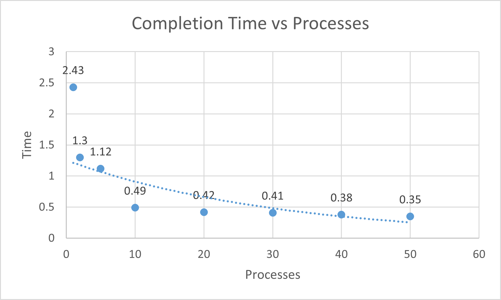

# System Programming Lab 11 Multiprocessing
Implementation was done by creating a for loop that would create multiple forks for as many processes you wish.
Each process was given a process number, using this and the number of processes total a workload is given
for each process that is a range of images it must generate.

## Runtime Analysis

| Processes | Time   |
|-----------|--------|
| 1         | 2m 43s |
| 2         | 1m 30s |
| 5         | 1m 12s |
| 10        | 0m 49s |
| 20        | 0m 42s |
| 30        | 0m 41s |
| 40        | 0m 38s |
| 50        | 0m 35s |

## Analysis
Every workload has a limit where adding more processes will not stop decreasing time.
As the graph and data shows, the closer the count gets to 50 processes the less and less
time that is saved by using that many processes. It should also be noted that when the process
count hits the number of cores in the CPU the parallelism no longer works as processes will start
being assigned to the same core, where each core is quickly switching between all the threads
it has running on it (async).

# Analysis with Threading
For implementing threads, I took the code that computes pixels in the image and moved it into
a thread where the thread can take in what range of pixel is needs. Then the compute image function
was modified to spawn the number of threads and manage them generating the parts of images and ensuring
their memory is managed.

| Processes | Threads | Time   |
|-----------|---------|--------|
| 1         | 1       | 2m 24s |
| 1         | 5       | 0m 52s |
| 1         | 10      | 0m 47s |
| 1         | 12      | 0m 53s |
| 2         | 1       | 1m 53s |
| 2         | 5       | 0m 53s |
| 2         | 10      | 0m 47s |
| 2         | 12      | 0m 22s |
| 4         | 1       | 1m 24s |
| 4         | 5       | 0m 40s |
| 4         | 10      | 0m 21s |
| 4         | 12      | 0m 20s |
| 12        | 12      | 0m 20s |

From looking at the results, it seems the times are similar to with only processing. My guess as to why
is that the time saved from adding extra threads to each image ended up being similar to just a larger
number of processes computing images. The computers we have also only seem to have two processing cores,
the other 10 are efficiency cores. So once you get over 12 it gets more and more inefficient as it tries
to collect those threads and processes to the same cores.

I find the sweet spot is at 12 processes with 12 threads, that evenly creates enough processes and threads
to make processing fast.